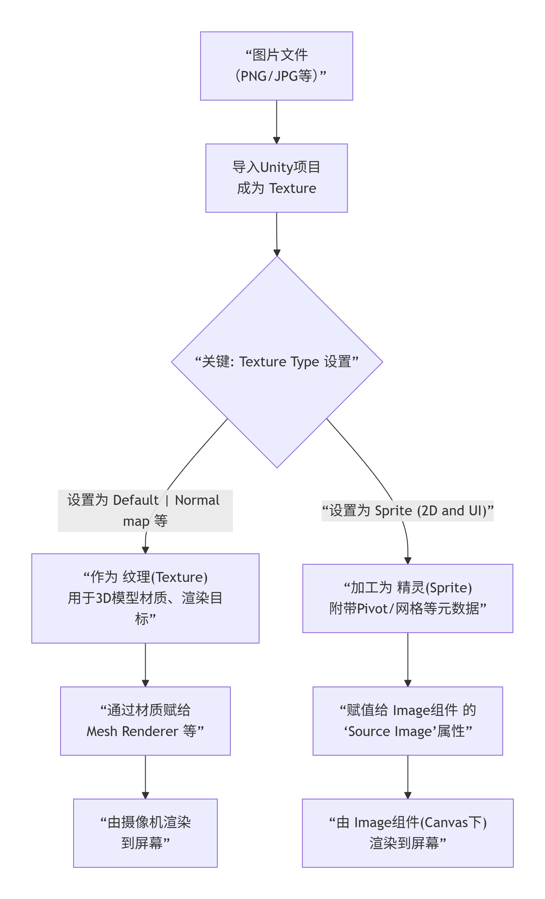

---
tags:
  - Unity
  - UI
  - 渲染
aliases:
time: 2025-12-28
---

# 3.==Texture==（纹理） - 原始的图像数据**

- **本质**：它是存储在内存中的**原始像素颜色矩阵**。你可以理解为一张“电子画布”。
    
- **来源**：通常是外部导入的图片文件（PNG, JPG），也可以是Unity程序运行时生成的。
    
- **核心用途**：
    
    - 作为 `Sprite` 的源数据。
        
    - 贴在3D模型表面，赋予其颜色和细节。
        
    - 作为渲染目标（Render Texture）或遮罩。
        
- **关键属性**：`width`, `height`, `filter mode`, `wrap mode`（决定拉伸和重复方式）。
# 2.==Sprite==（精灵） - 为2D游戏优化的纹理“切片”**

- **本质**：它是一个**结构体**，不仅包含了对 `Texture` 数据的引用，还额外附加了用于2D显示的**元数据**。
    
- **来源**：在Unity编辑器中，将一个 `Texture` 的 **“Texture Type”** 设置为 **“Sprite (2D and UI)”**，它就会变成一个 `Sprite` 资产。可以从一张大纹理上切割出多个 `Sprite`（图集）。
    
- **核心用途**：专用于2D游戏和UI系统。它是 `Image` 组件可以直接使用的格式。
    
- **关键属性**：`pivot`（轴心点，旋转和缩放的中心）、`border`（九宫格拉伸边框）、关联的纹理矩形区域。
# **3. Image（UI） - 用于在UI画布上显示Sprite的组件**

- **本质**：它是一个 `MonoBehaviour` 组件，继承自 `MaskableGraphic`，是UGUI系统的一部分。
    
- **来源**：只能在 `Canvas`（画布）下的UI对象上添加。
    
- **核心用途**：在屏幕上显示一个 `Sprite`，并控制其颜色、填充、材质等渲染属性。
    
- **关键属性**：`sprite`（源精灵）、`color`（叠加颜色）、`Image Type`（Simple、Sliced九宫格、Filled填充等）。
