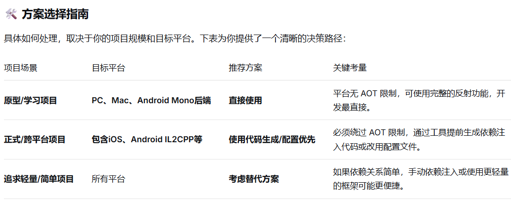
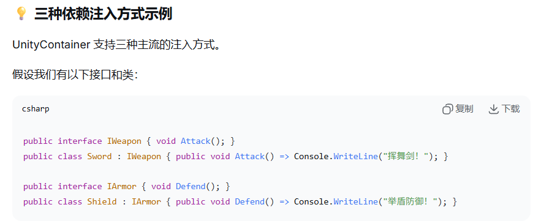
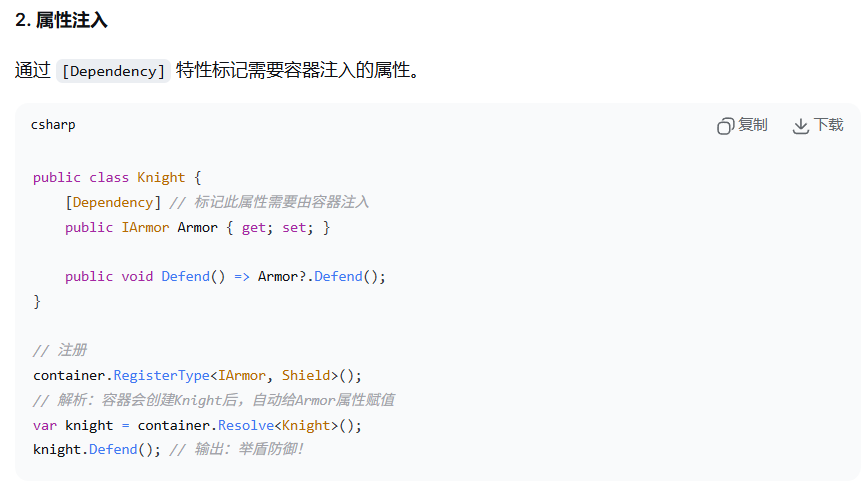
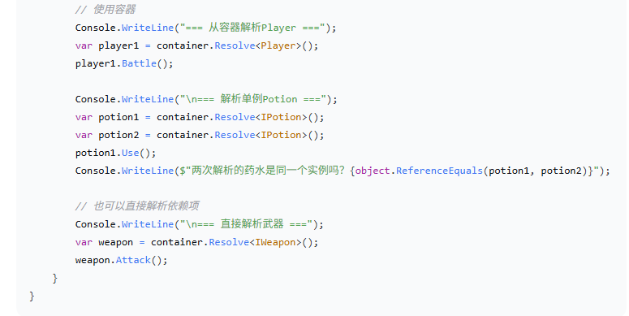
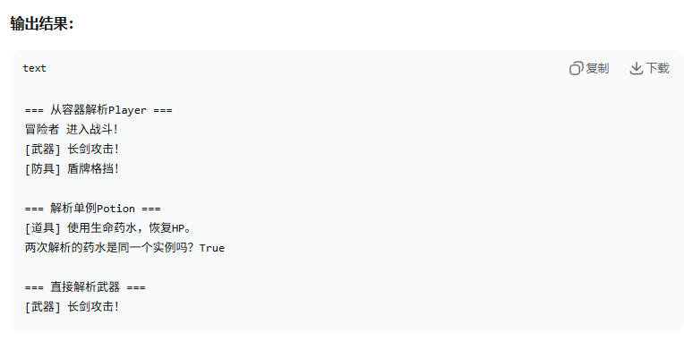
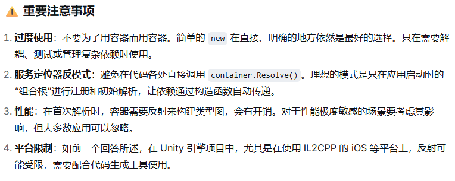

---
tags:
  - Unity
  - 可扩展
  - 设计模式
aliases:
time: 2025-12-29
---
# ==使用限制(后文还有注意事项)==
最主要的限制来自某些**移动和主机平台（如 iOS、Android IL2CPP 后端等）**。这些平台要求代码**提前编译（AOT）**，不允许在运行时动态生成代码。这会影响依赖注入容器在运行时通过反射动态创建类型的能力。

# ==概念==

# ==注意事项==
