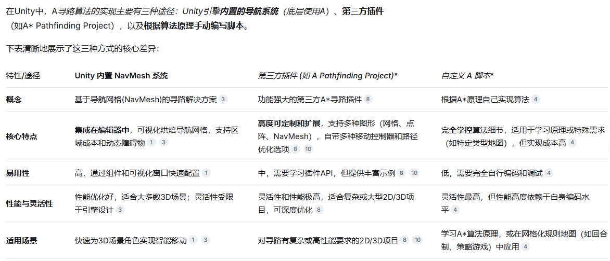

---
tags:
  - 寻路算法
  - Unity插件
aliases:
time: 2025-12-25
---
### 
#  AStar算法实现

如果你需要学习算法原理，或项目需求特殊（如基于固定网格的策略游戏），可以自己编写A*算法。其核心步骤如下，实现时可参考网页中的代码示例：
==启发式探索==为核心，代价函数为实现方式
1. **抽象地图**：将地图划分为网格（Grid），每个网格是一个节点。
    
2. **定义代价函数**：每个节点包含 **F**（总代价）、**G**（从起点到当前点的实际代价）、**H**（从当前点到目标的预估代价，即启发值），关系为 `F = G + H`。
    
3. **使用开放和关闭列表**：
    
    - 将起点加入**开放列表 (Open List)**。
        
    - 每次从开放列表中取出**F值最小**的节点作为当前节点，将其移入**关闭列表 (Close List)**。
        
    - 检查当前节点的所有可行走邻居节点：
        
        - 若邻居在关闭列表，跳过。
            
        - 若不在开放列表，则加入并计算其`F`、`G`、`H`值，将当前节点设为其父节点。
            
        - 若已在开放列表，则检查经由当前节点到达它是否`G`值更小，是则更新其父节点和`G`、`F`值。
            
    - 重复此过程，直到目标节点被加入开放列表（寻路成功）或开放列表为空（无路径）。
![[../附件/Pasted image 20251225220433.png]]
