---
tags:
  - 存储
  - Unity
aliases:
time: 2025-12-30
---
**SO是Unity资产，与编辑器深度集成，方便策划拖拽、实时预览**
[存储方案建议](存储方案建议.md)
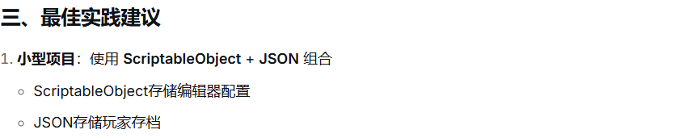

##  [ScriptableObject](ScriptableObject.md)+ [事件_委托](../编程思想/C#/事件_委托.md)/[依赖注入](../编程思想/设计框架/依赖注入.md)
#### 这个组合拳能完美替代“可观察、跨场景的==MonoBehaviour单例==”

**ScriptableObject（SO）天生就是为这个场景设计的**：数据独立于场景存在，在编辑器中完全可视化，且生命周期可控

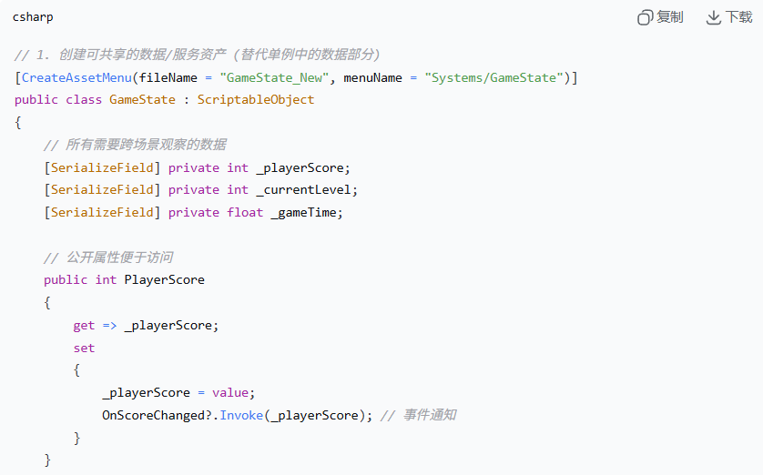**使用方法：**

1. 在Project中创建`GameState`资产（右键Create → Systems → GameState）
    
2. **跨场景引用**：任何需要它的MonoBehaviour都这样声明：
3. 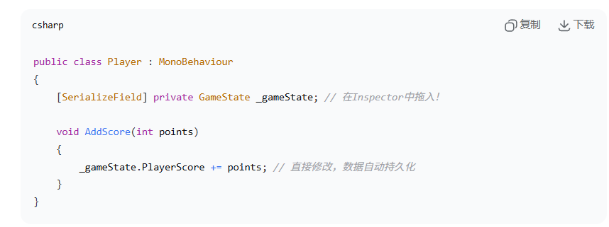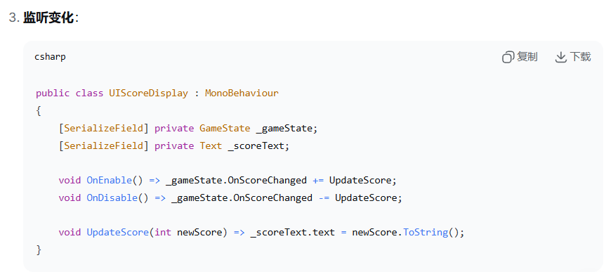**优点：**

- ✅ **跨场景**：SO资产独立于场景，引用它的对象销毁后数据仍在
    
- ✅ **完全可视化**：所有字段在Inspector中实时显示，可手动调试修改
    
- ✅ **无需静态引用**：通过序列化字段引用，避免了`Instance`全局访问
    
- ✅ **支持多实例**：可创建多个`GameState`资产用于测试不同配置
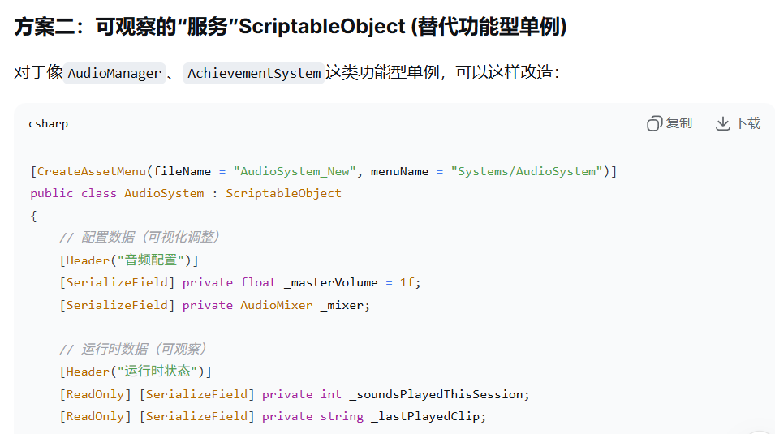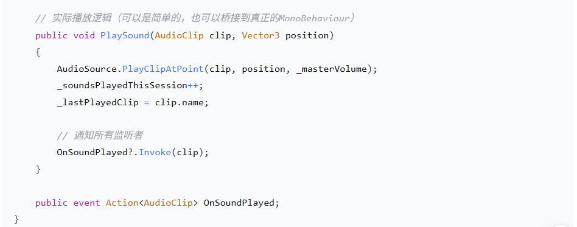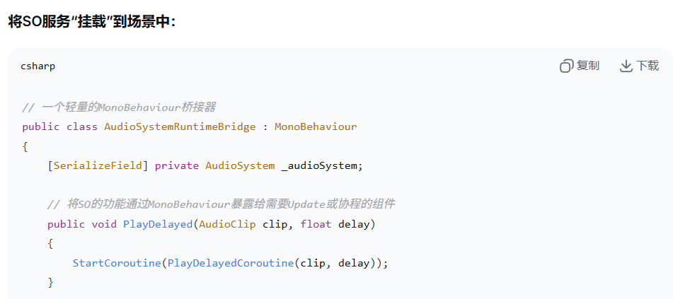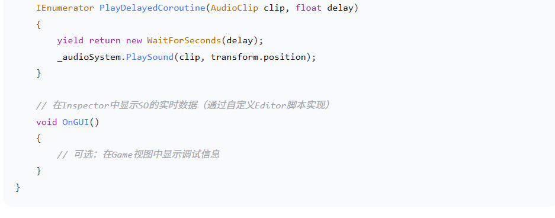
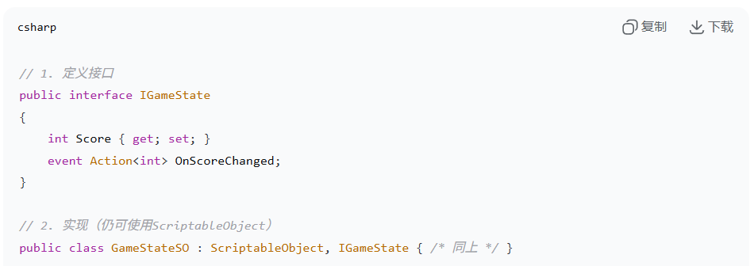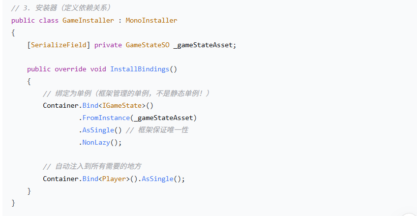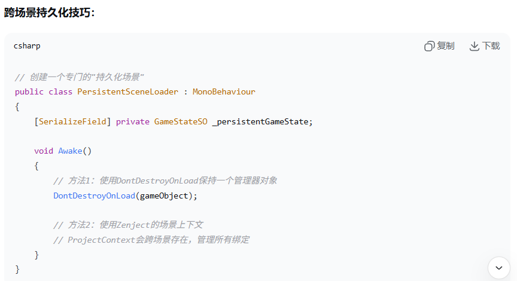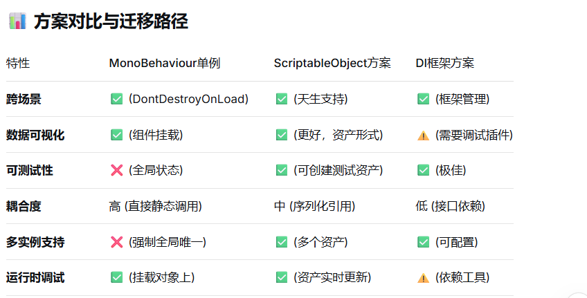
##  渐进式迁移指南

如果已有大型单例代码库，不要重写！逐步迁移：
# 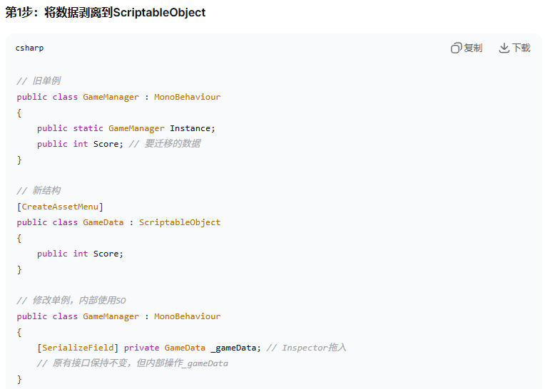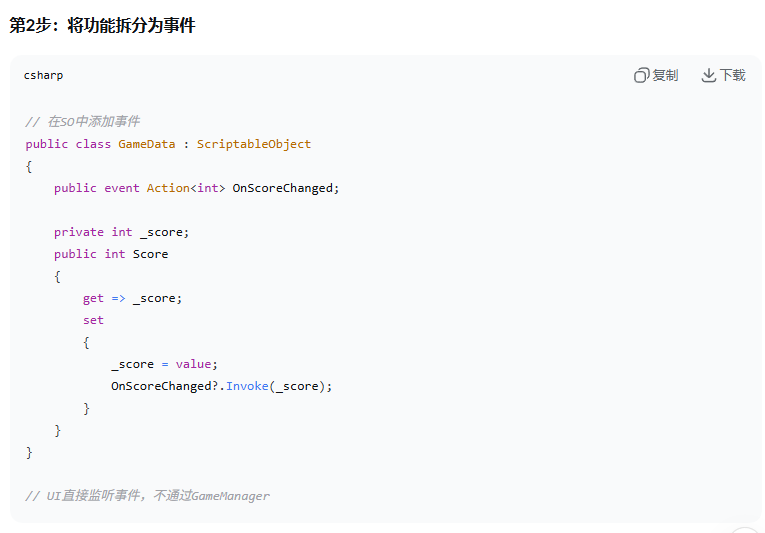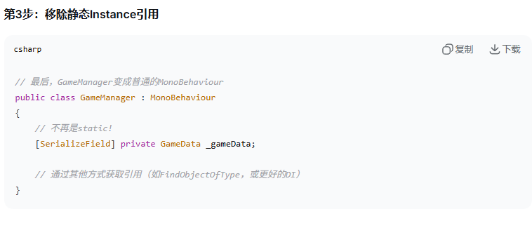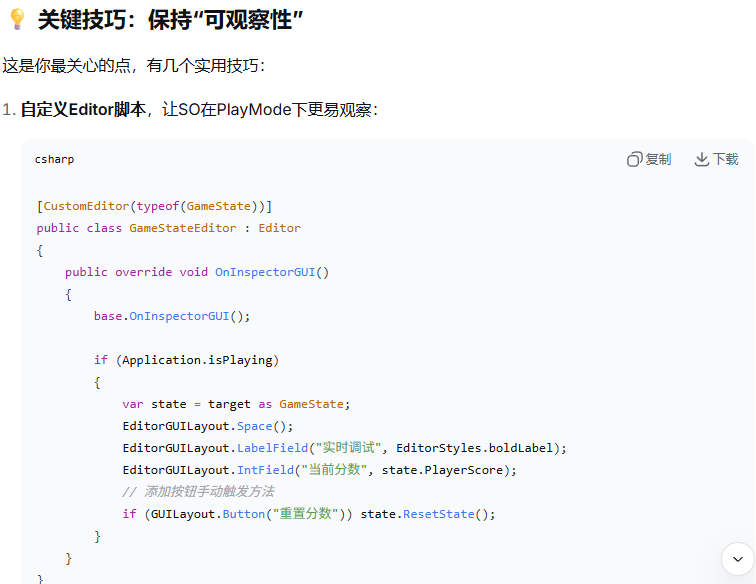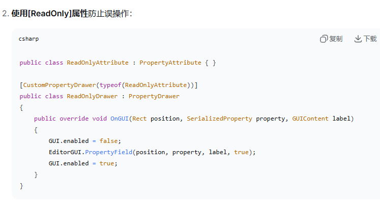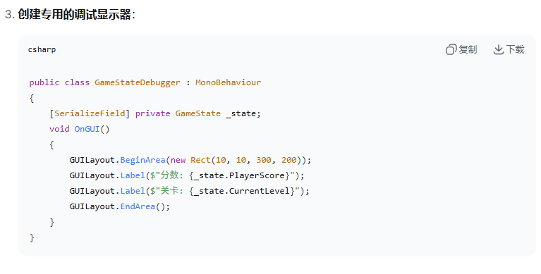总结建议

对于你的需求，我强烈推荐**方案一：ScriptableObject作为可视化数据中心**。它能：

1. **完美满足你的两个核心需求**：
    
    - 数据在SO资产中，**天然跨场景**
        
    - 在Project窗口中双击资产，**所有数据一览无余**，比在Hierarchy中找单例对象更清晰
        
2. **额外获得的好处**：
    
    - 支持**多存档/多配置**（创建多个SO文件）
        
    - **撤销/重做**支持（对SO的修改可撤销）
        
    - **版本控制友好**（SO是文本文件，可Diff）
        
    - **资源卸载管理**（SO可被Resources.UnloadUnusedAssets清理）
        
3. **迁移成本低**：可以从现有单例中逐步抽离数据到SO，接口可保持不变。
    

这个方案本质上是将“单例”的职责拆分：**数据/配置**放在SO中，**功能逻辑**放在普通的MonoBehaviour或纯C#类中，**通信**通过事件。既保持了Unity编辑器工作流的便利性，又得到了更好的架构。