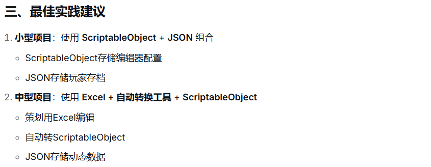
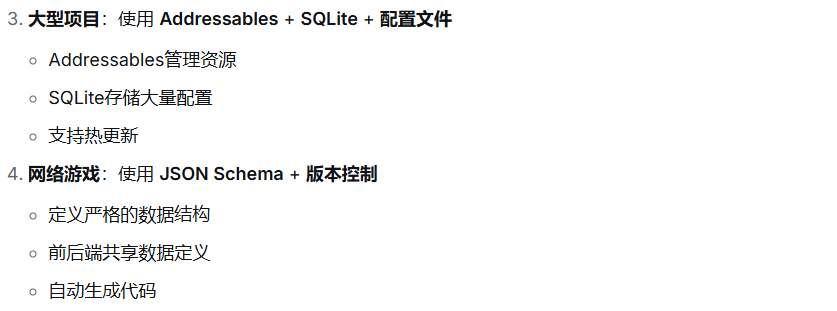
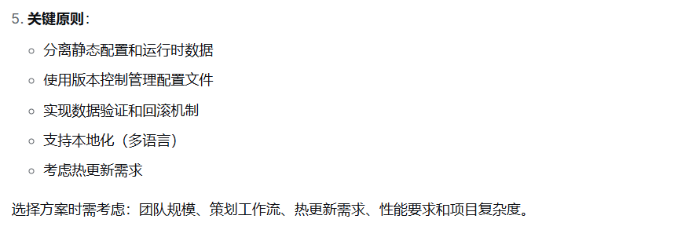

---
tags:
  - 存储
aliases:
time: 2025-12-30
---
**SO是Unity资产，与编辑器深度集成，方便策划拖拽、实时预览**；
**JSON是纯文本，易于版本控制、网络传输和跨平台**。
同时提到在团队中，会为策划编写**自定义Editor工具**来简化复杂SO的填写
[ScriptableObject](ScriptableObject.md)
[Json_XML](Json_XML.md)
[Excel_CSV_自定义转换工具](Excel_CSV_自定义转换工具.md)
[SQLite数据库](SQLite数据库.md)
[Unity Addressable Asset System](Unity%20Addressable%20Asset%20System.md)
