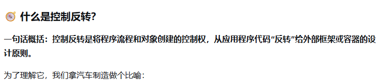
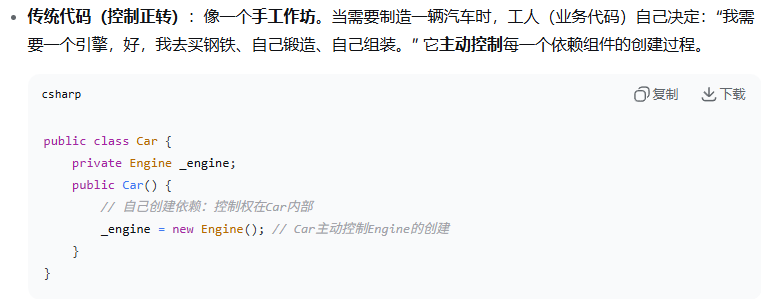
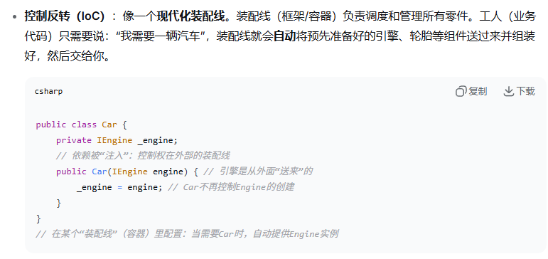
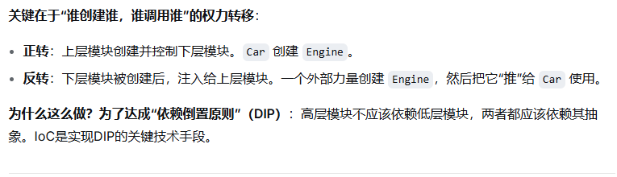
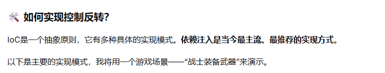
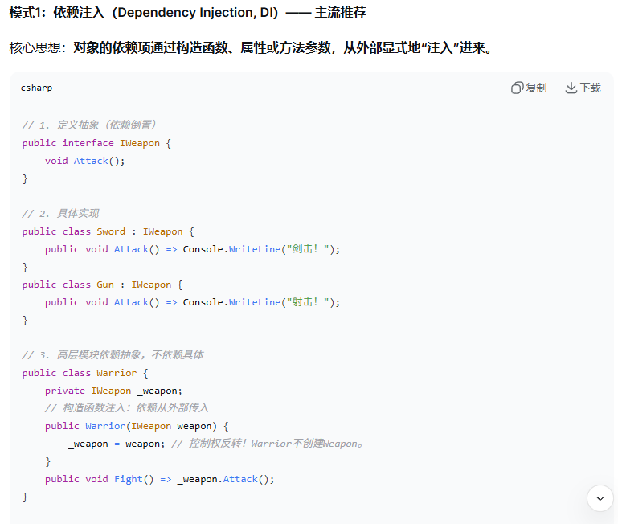
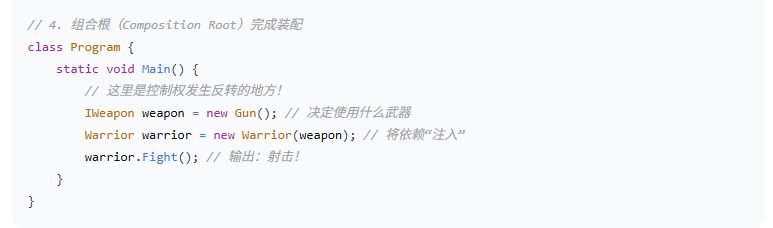

---
tags:
  - 设计模式
aliases:
time: 2025-12-25
---
[UnityContainer(上)](../../Unity知识/UnityContainer(上).md)
[UnityContainer(下)](../../Unity知识/UnityContainer(下).md)
**为什么这么做？为了达成“依赖倒置原则”（DIP）**：==高层模块不应该依赖低层模块，两者都应该依赖其抽象==。IoC是实现DIP的关键技术手段。

进阶内容参考UnityContainer
[UnityContainer(上)](../../Unity知识/UnityContainer(上).md)
[UnityContainer(下)](../../Unity知识/UnityContainer(下).md)