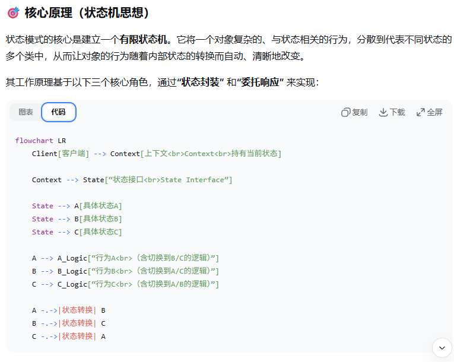

---
tags:
  - 设计模式
aliases:
time: 2025-12-31
---
[有限状态机FSM](../算法/有限状态机FSM.md)
**状态模式是一种行为型设计模式，它允许一个对象在其内部状态改变时，自动改变其行为，使得这个对象看起来像是改变了其所属的类。**

简单比喻：一个 **“情绪化的人”**。

- **策略模式**：如同一个人**主动选择工具**（用笔写字、用键盘打字）。
    
- **状态模式**：如同一个人**根据自身情绪自动改变行为**（开心时唱歌，难过时沉默，生气时怒吼）。行为的改变由**内部状态驱动**。

1. **状态接口**定义了一个对象在特定状态下所有可能的行为。
    
2. **具体状态**不仅实现了自身状态下的行为逻辑，**更关键的是，它知晓并能触发向其他状态的转换**。
    
3. **上下文**持有一个当前状态对象的引用。当客户端调用上下文的方法时，上下文**将请求委托给当前状态对象处理**。状态对象在执行逻辑后，可以主动通知上下文切换到另一个状态。
### **设计精髓**

1. **本地化状态逻辑**：
    
    - 所有与特定状态相关的**行为和数据**都封装在对应的状态类中。这符合“单一职责原则”，每个状态类只关心自己的事。
        
    - 添加新状态时，只需新增一个类，无需修改现有状态类或上下文的主要逻辑（**开闭原则**）。
        
2. **清晰的状态转换**：
    
    - 状态转换的逻辑可以放在**上下文**中（通过条件判断），但更纯粹的作法是将转换规则也**封装在状态类内部**（如上面代码所示）。这使得转换逻辑与状态行为紧密关联，易于理解和维护。
        
3. **消除庞大的条件语句**：
    
    - 传统的状态管理依靠上下文中的 `switch (currentState)` 语句来分发行为，代码臃肿且难以维护。
        
    - 状态模式利用**多态**，让上下文对任何状态都发出同样的请求（如 `Execute`），具体做什么由当前状态对象决定，从而消除了分支判断。

