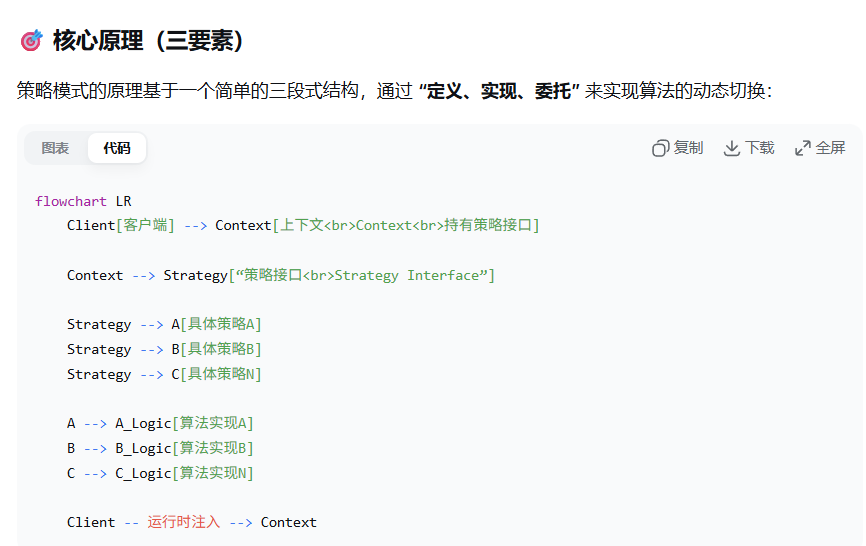

---
tags:
  - 设计模式
aliases:
time: 2025-12-31
---
策略模式是一种**行为型设计模式**，它的核心思想是**将一组可互换的算法封装起来，并使它们能够独立于使用它们的客户端而变化**。
1. **策略接口** 定义了一个所有支持算法的公共契约。
    
2. **具体策略** 各自独立地实现了这个接口，提供了算法的具体版本。
    
3. **上下文** 并不自行实现算法，而是**持有一个策略接口的引用**，并将工作“委托”给它。客户端负责在运行时为上下文选择合适的策略。

### **设计精髓**

1. ==**将变与不变分离**==：
    
    - **变化的是什么？** → 具体的算法（如攻击方式、压缩方法、支付流程）。
        
    - **不变的是什么？** → 客户端调用算法的方式，以及算法的接口。
        
    - 策略模式将**变化的算法**封装到各个具体策略类中，让**不变的上下文**稳定地依赖一个抽象接口。
        
2. ==**组合优于继承**==：
    
    - 传统的做法可能通过继承，在子类中覆盖算法方法。这会导致类爆炸（大量子类），且难以在运行时改变行为。
        
    - 策略模式通过**在类内部包含一个算法对象（组合）** 来动态改变行为，比继承更灵活。
        
3. ==**消除条件判断语句**==：
    
    - 在没有使用策略模式时，代码中常常出现冗长的 `if-else` 或 `switch` 语句来选择算法。
        
    - 策略模式通过多态机制，让上下文**无需知道具体是哪种算法**，只需调用接口方法，由运行时绑定的具体策略对象来执行。这使得代码更简洁、更易扩展。